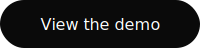

# static-to-variable

Turn static fonts into one variable font.

[](https://www.npmjs.com/package/static-to-variable)

Got thin, regular, and bold font files? Get back one file you can slide between. You can't just merge them: each weight is drawn separately and nothing lines up. static-to-variable redraws them onto one shared structure, checks every letter, and skips what it can't convert.

<p>
<a href="https://static-to-variable.blode.md">

</a>
<a href="https://variable.blode.co">

</a>
</p>

## Install

```bash
npm install -g static-to-variable
```

Needs [Node](https://nodejs.org) 24.11+, [Python](https://www.python.org) 3.11+, and [uv](https://docs.astral.sh/uv/).

## Use it

From a folder with your font files:

```bash
static-to-variable init    # finds fonts, writes stv.config.json
static-to-variable build   # variable font to build/
static-to-variable release # final TTF and WOFF2
```

Reverse it with `static-to-variable split MyFamily-VF.ttf` (one static per weight). Stuck? Run `static-to-variable doctor`.

## Going further

- Italics, named instances, per-glyph fixes: [schema](schemas/stv-config.schema.json) and [Inter example](examples/inter).
- Teach your coding agent the CLI: `npx skills add mblode/static-to-variable`.
- [CLI docs](packages/cli/README.md).

## Licenses

The code is [MIT](LICENSE.md). Your fonts keep their own licenses, and that matters: converting a font counts as modifying it, which most commercial EULAs forbid, so you need the foundry's permission. Open licenses like the [SIL OFL](https://openfontlicense.org) (most of Google Fonts) allow it. Your own fonts are fine.

---

Crafted by [](https://matthewblode.com) [Matthew Blode](https://matthewblode.com)
